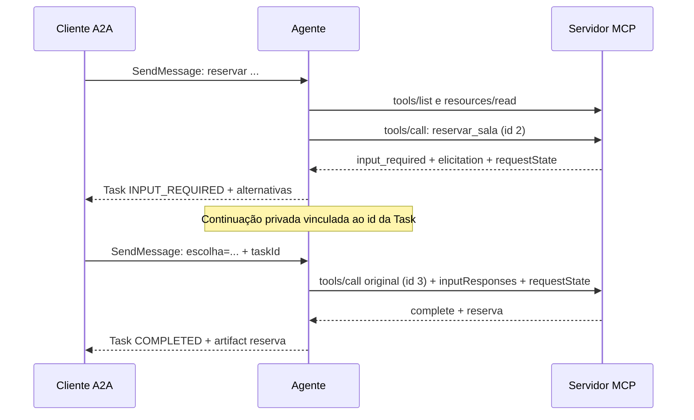

# A Ponte: agente A2A com MCP

Solução do [desafio da Full Cycle](https://github.com/devfullcycle/desafio-a2a-com-mcp).
Dois processos: um servidor MCP oferece as salas e um agente A2A traduz pedidos e escolhas em chamadas MCP. O agente decide por regras, sem LLM.

## Como rodar

Requisitos: Node.js 20 ou superior, npm e Python 3.10 ou superior. As dependências diretas têm versões exatas; `package-lock.json` fixa a árvore completa. Não há etapa de compilação.

```bash
git clone https://github.com/m3g-marvin/desafio-a2a-com-mcp.git
cd desafio-a2a-com-mcp
npm ci
```

No primeiro terminal, gere a chave e suba o MCP:

```bash
export REQUEST_STATE_SECRET="$(python3 -c 'import secrets; print(secrets.token_hex(32))')"
npm run start:mcp
```

A chave é hexadecimal e precisa representar pelo menos 32 bytes aleatórios. Para testar a retomada após restart, interrompa com `Ctrl+C` e execute apenas `npm run start:mcp` **no mesmo terminal**: a variável exportada continua disponível. Gerar outra chave invalida os estados emitidos anteriormente. Não publique o valor da chave.

No segundo terminal, na raiz do clone:

```bash
npm run start:agent
```

No terceiro terminal, também na raiz:

```bash
curl http://localhost:7300/.well-known/agent-card.json
python3 validador/validar.py --agente http://localhost:7300 --mcp http://localhost:7301
```

Execute o validador com **os dois processos recém-iniciados**. Ele cria reservas; rodá-lo novamente sobre a mesma agenda muda os resultados. Para os exemplos manuais do starter, reinicie os processos depois do validador pelo mesmo motivo.

Os processos escutam em `127.0.0.1`. Configurações opcionais:

| Variável | Padrão | Uso |
| --- | --- | --- |
| `MCP_PORT` | `7301` | Porta do MCP; endpoint `/mcp` |
| `AGENT_PORT` | `7300` | Porta do agente; endpoint `/a2a` |
| `MCP_URL` | `http://127.0.0.1:7301/mcp` | Destino HTTP do host MCP |
| `AGENT_URL` | `http://127.0.0.1:<AGENT_PORT>` | URL base anunciada no Agent Card |
| `REQUEST_STATE_SECRET` | Obrigatória | Chave hexadecimal, somente no processo MCP |

Para verificar a implementação sem preparar terminais ou chaves:

```bash
npm run check
npm test
```

Os testes geram chaves temporárias, usam portas livres e encerram os processos criados. Incluem as 36 verificações originais, restart real do MCP com uma Task pausada, expiração, assinatura adulterada, uso do estado em outra ferramenta, argumentos adulterados, capability de form explícita, headers divergentes, recusa, conflito no retry, limites da política, estado `WORKING` e proteção de Tasks terminais.

## Onde a ponte acontece

Em [`agente/ponte.js`](agente/ponte.js), `consume()` recebe o `input_required`, extrai a chave e as alternativas da elicitation e guarda o token opaco em `record.pending`, junto da Task. `pause()` muda o estado para `TASK_STATE_INPUT_REQUIRED` e publica a linha `alternativas: ...`. Na continuação, `send()` mantém os argumentos originais e acrescenta `inputResponses` e o mesmo `requestState`; [`agente/mcp.js`](agente/mcp.js) faz uma nova chamada pelo SDK, que atribui outro id JSON-RPC. O cliente usa `autoFulfill: false` e `allowInputRequired: true` para que a pergunta volte ao cliente A2A. Somente `record.task` é serializado nas respostas públicas.



O MCP também pode concluir imediatamente, devolver erro de execução ou concluir uma recusa. A ponte converte esses resultados em `COMPLETED`, `FAILED` e `CANCELED`, respectivamente. Uma escolha fora das alternativas repete a pausa, sem chamar o MCP. Tasks diferentes têm registros independentes.

## Decisões técnicas

- **SDK oficial MCP v2.1.0**, com revisão `2026-07-28` fixada no cliente. `createMcpHandler`, `Server` e `toNodeHandler` cuidam do transporte Streamable HTTP, dos metadados obrigatórios, do espelhamento de headers e dos envelopes JSON-RPC. O servidor atende cada request com uma instância nova e usa respostas JSON.
- **MRTR pelo SDK:** `inputRequired()` produz a elicitation; `inputResponse()` e `acceptedContent()` interpretam o retry. Não há callback que espere a resposta do usuário dentro de uma chamada aberta.
- **Integridade:** `createRequestStateCodec()` assina o estado com HMAC-SHA256 e validade de **600 segundos**. O token contém os argumentos originais, a lista de alternativas e a chave da pergunta. O vínculo inclui método e `Mcp-Name`; o SDK verifica a assinatura e a expiração antes da tool e devolve `-32602` se falharem. Os argumentos do retry não substituem os valores selados. A disponibilidade da sala escolhida é conferida novamente antes de reservar.
- **Estado:** reservas ficam em memória no MCP e começam com os dados do starter. Tasks e continuações ficam em um `Map` privado do agente. Reiniciar o MCP preserva a validade de um token se a chave continuar igual; reiniciar o agente perde as Tasks. Reservas voltam ao estado inicial após restart, conforme o escopo do desafio.
- **Domínio:** [`servidor-mcp/salas.js`](servidor-mcp/salas.js) lê os JSON e a política originais. Os horários são comparados no fuso fixo `-03:00`, com intervalos de fim exclusivo; reservas adjacentes são permitidas. Não existe consulta à data atual para decidir uma reserva.
- **Descoberta:** o agente obtém a definição das tools por `tools/list`, antes da primeira chamada, e lê `politica://uso` para compor o artifact. A intenção fixa identifica `reservar_sala` entre as tools descobertas. O agente não lê `dados/` nem calcula conflitos ou alternativas.
- **Trace:** um contexto assíncrono por chamada inclui o `traceparent` A2A no `_meta` das requisições MCP, incluindo a descoberta inicial. A Task conserva seu trace na retomada. O stderr do MCP registra método, id e traceparent, sem registrar os tokens ou a chave.
- **A2A v1.0:** o binding JSON-RPC é implementado com `node:http`, limitado a `SendMessage` e `GetTask`. O card publica `supportedInterfaces` com `JSONRPC` e versão `1.0`. O histórico preserva as mensagens da tool, e estados terminais recusam novas mensagens.
- **Determinismo:** escolhas e alternativas dependem somente do pedido e da agenda corrente. UUIDs identificam Tasks, mensagens e artifacts. Um pedido de criação pode alterar a agenda; a repetição de duas pausas sobre o mesmo estado produz o mesmo texto, como verifica o starter.

### Por que usar `Server` em vez de `McpServer`

A API `Server` do SDK permite preservar a separação entre erro de protocolo e erro de execução. Na versão fixada, o handler de `McpServer` transforma quase toda exceção de tool em `isError`, inclusive `MissingRequiredClientCapabilityError`. O trecho em `setToolRequestHandlers()`, distribuído em `node_modules/@modelcontextprotocol/server/dist/mcp-Dw2OlZ1f.mjs`, contém:

```js
if (error instanceof ProtocolError && error.code === ProtocolErrorCode.UrlElicitationRequired)
  throw error;
return this.createToolError(error instanceof Error ? error.message : String(error));
```

O contrato exige `-32021` com HTTP 400 quando falta **form** explícito. O servidor registra os handlers na API `Server` e lança o erro tipado do próprio SDK. O SDK continua responsável pelo protocolo, pelo transporte e pelo MRTR. O teste inclui `{}`, `{ elicitation: {} }` e `{ elicitation: { url: {} } }`, todos recusados quando a reserva exige a pergunta.

Referências: [MRTR e requestState no SDK oficial](https://github.com/modelcontextprotocol/typescript-sdk/blob/main/docs/servers/input-required.md), [revisão MCP 2026-07-28](https://github.com/modelcontextprotocol/typescript-sdk/blob/main/docs/migration/support-2026-07-28.md) e [especificação A2A](https://a2a-protocol.org/latest/specification/).

## Saída do validador

Verificado em clone limpo com `npm ci`, Node.js 26.8.1, os dois processos iniciados pelos comandos acima e reservas no estado inicial. Formatação e os sete testes também passaram.

```text
trace-id desta execucao: 66e4b7cd47aaab789326745a3edff0f7
procure esse valor no stderr do servidor MCP para conferir a propagacao do traceparent.

PASS 01 tools/list traz as tres tools
PASS 02 toda tool tem inputSchema de objeto
PASS 03 listar_salas devolve structuredContent e o mesmo JSON em texto
PASS 04 _meta sem protocolVersion devolve -32602 e HTTP 400
PASS 05 _meta sem clientCapabilities devolve -32602 e HTTP 400
PASS 06 tool inexistente e recusada, por -32602 ou por isError
PASS 07 resources/read de politica://uso devolve a politica
PASS 08 resources/read de URI inexistente devolve -32602
PASS 09 sala inexistente devolve isError com a mensagem exata
PASS 10 fora da janela devolve isError com a mensagem exata
PASS 11 duracao acima de 2h devolve isError com a mensagem exata
PASS 12 intervalo invertido devolve isError com a mensagem exata
PASS 13 conflito devolve input_required com inputRequests e requestState
PASS 14 a elicitation e form mode e oferece as alternativas na ordem certa
PASS 15 conflito sem a capability elicitation devolve -32021 e HTTP 400
PASS 16 retry com inputResponses e requestState conclui a reserva
PASS 17 requestState adulterado e rejeitado com -32602
PASS 18 argumentos adulterados no retry nao tomam efeito
PASS 19 recusa conclui sem reservar e sem isError
PASS 20 conflito sem alternativa possivel devolve isError com a mensagem exata

PASS 21 agent card responde 200 no well-known com JSON
PASS 22 o card declara a interface JSON-RPC com url e versao 1.0
PASS 23 o card declara a skill reservar-sala
PASS 24 SendMessage com sala livre conclui a Task
PASS 25 o artifact chama reserva e traz a versao da politica
PASS 26 GetTask devolve id, contextId e estado corrente
PASS 27 SendMessage com sala ocupada pausa a Task
PASS 28 a Task pausada lista as alternativas na ordem certa
PASS 29 escolha fora do enum mantem a Task pausada
PASS 30 a continuacao conclui a Task na sala escolhida
PASS 31 SendMessage em Task terminal e recusado
PASS 32 a recusa termina a Task em CANCELED
PASS 33 duas Tasks pausadas ao mesmo tempo concluem cada uma com a sua reserva
PASS 34 nenhuma resposta A2A carrega o requestState
PASS 35 sala inexistente termina a Task em FAILED com a mensagem da tool
PASS 36 o agente e deterministico: o mesmo pedido produz a mesma pausa

resumo: 36 passaram, 0 falharam, de 36 verificacoes
```

O [log MCP desta execução](evidencias/mcp.jsonl) registra a descoberta antes da primeira chamada, o trace-id acima e ids distintos para chamada e retry.

